# Agent Deck Harness Core

A small, provider-neutral runtime and SDK for reliable long-horizon agents.



The project is intentionally not a model wrapper and not a multi-agent role-playing framework. It owns the execution semantics that must remain stable across Codex, Claude Code, API models, local models, and future providers:

- externally persisted task state;
- bounded execution contracts;
- fresh execution contexts;
- independent, evidence-backed verification;
- explicit human-attention transitions;
- crash-safe checkpoints and append-only events;
- latency and call-count instrumentation;
- a versioned streaming run-item protocol with ordered replay and deduplication.

## Status

`0.1.0` is the first research milestone. The API is not stable yet.

Implemented:

- provider-neutral Manager, Executor, and Auditor contracts;
- a Manage → Execute → Audit state machine;
- a verified state ledger for requirements, facts, artifacts, evidence, and blockers;
- bounded context assembly using explicit references;
- in-memory and atomic JSON-file stores;
- a transactional SQLite store with migrations, cursor paging, and snapshot recovery;
- resume after process restart or human attention;
- invalid-completion protection;
- deterministic state-machine tests;
- versioned run-item envelopes for text, tools, approvals, artifacts, audit findings, errors, and terminal states;
- deterministic reconstruction under duplicate and out-of-order delivery.

Not implemented yet:

- model or CLI adapters;
- sandboxed tool execution;
- streaming item protocol;
- adaptive direct-vs-managed routing;
- context folding and retrieval;
- concurrency or DAG scheduling;
- Agent Deck integration.

## Example

```ts
import { AgentHarness, JsonFileRunStore } from "@agent-deck/harness";

const harness = new AgentHarness({
  store: new JsonFileRunStore(".harness"),
});

const state = await harness.start({
  goal: "Create a tested deliverable",
  requirements: [
    { id: "tests", description: "The acceptance test passes" },
  ],
  manager,
  executor,
  auditor,
});
```

The executor may report success, but the run only completes after the auditor records clean environment evidence for every requirement.

## Development

```bash
npm install
npm test
```

See [Architecture](docs/ARCHITECTURE.md), [Run Item Protocol](docs/RUN_ITEM_PROTOCOL.md), [SQLite Store](docs/SQLITE_STORE.md), [Roadmap](docs/ROADMAP.md), and [ADR-0001](docs/decisions/0001-verified-state-ledger.md).

## Relationship to DeepSeek Harness

DeepSeek Harness is an engineering reference and upstream research target. This repository is a clean implementation with a deliberately smaller scope. No DeepSeek Harness source code is copied into the core. If code is adopted later, its provenance and license will be recorded explicitly.
