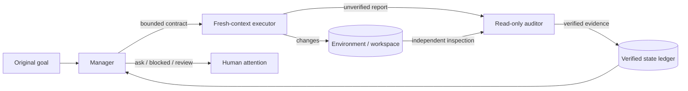

# Architecture

## Design thesis

Long-horizon execution is primarily a state-management and verification problem. Agent Deck Harness keeps the durable task state outside model context and lets interchangeable backends operate on bounded contracts.

The diagram separates five concerns that must not collapse into one model conversation:

1. **Product boundary** — Agent Deck or another client uses the public SDK; it does not own runtime truth.
2. **Control plane** — the router chooses the least costly safe path and the Manager compiles one bounded contract.
3. **Execution plane** — a fresh-context Executor operates through replaceable provider and tool adapters.
4. **Verification plane** — a read-only Auditor inspects the actual environment before evidence enters trusted state.
5. **Durable runtime** — events, snapshots, metrics, replay, and human-attention states survive model calls and process restarts.

Solid `M0` labels are implemented in the current kernel. Dashed connections and `M1`/`M2` labels show planned protocol, persistence, and routing work.

### Compact control loop

The graph shown by a product is a projection of this state. It is not the source of truth.

## Invariants

1. The original goal is immutable.
2. Executor claims never complete requirements.
3. A completed record has at least one persisted evidence reference.
4. Evidence from a suspect or violating audit cannot create trusted state.
5. Execution receives only the contract and explicitly referenced records, never the raw event log.
6. State is persisted before an event is exposed to product integrations.
7. A run is bounded by rounds, time, provider, and tool budgets.
8. Human attention is requested only through explicit state transitions.

## Core roles

### Manager

Owns control decisions, not environment mutation. It chooses one of `execute`, `ask`, `blocked`, or `done`. An execution decision contains a bounded contract with acceptance criteria and context references.

### Executor

Is the only role intended to mutate the environment. Each invocation receives a fresh context. Its report is useful for locating changes but is not trusted evidence.

### Auditor

Independently inspects the environment. Production adapters should expose read-only tools and enforce mutation detection. Only a clean audit can advance trusted state.

## Context model

The SDK will evolve toward four layers:

1. **Task anchor** — immutable goal, constraints, and acceptance criteria.
2. **Verified state** — evidence-backed facts, artifacts, decisions, and blockers.
3. **Working set** — recent, high-fidelity state needed by one contract.
4. **Raw trajectory** — retained for replay and debugging, excluded from prompts by default.

## Research basis

- [LongHorizon-Harness](https://arxiv.org/abs/2608.01964): external task state, fresh-context execution, independent read-only audit.
- [OneDayAgent](https://arxiv.org/abs/2608.05013): bounded subtasks, execution memory, global verification, and targeted repair.
- [Context as a Tool](https://arxiv.org/abs/2512.22087): stable task semantics, condensed long-term memory, and recent high-fidelity interactions.
- [SWE-agent](https://arxiv.org/abs/2405.15793): agent-computer interface design materially affects agent performance.
- [Agentless](https://arxiv.org/abs/2407.01489): simple, specialized workflows are a necessary baseline against complex agent systems.
- [tau-bench](https://arxiv.org/abs/2406.12045): state-based evaluation and repeated-run reliability.
